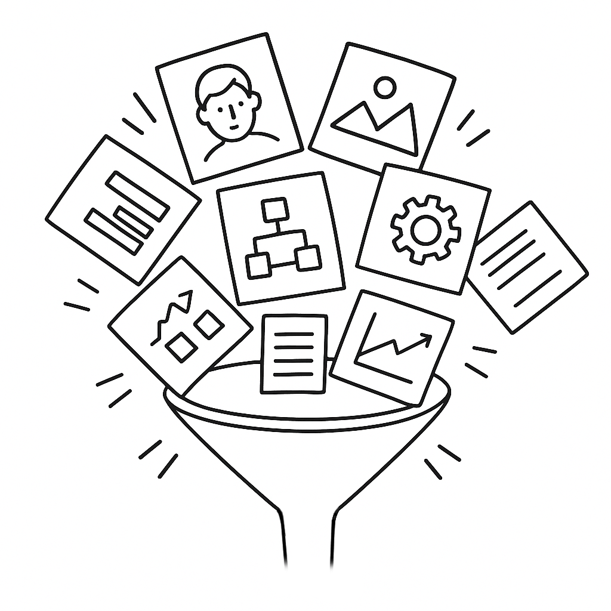
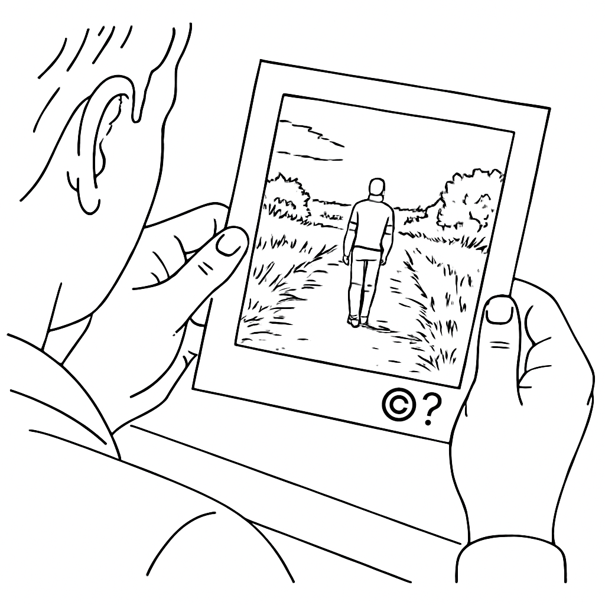

# Copyright

## Intellectual Property

Intellectual property (IP) is a set of legal rights that protect products of human creativity and ingenuity in the form of inventions, expressions, ideas, symbols, and designs. These rights give the owner the exclusive right to profit from the IP's use or distriubution, and the owner can license or sell these rights to others. The most common varieties of IP include **patents**, **copyright**, **trademarks**, and **industrial designs** (among others). Each different form of IP has unique requirements, legal regimes, and durations of protection.

## What is Copyright?

Copyright is a form of IP that protects the creators of literary, musical, and artistic works for a limited term (the creator's life plus 70 years in the US and Canada). The limited term eventually allows society to freely use and build upon creative outputs. 
> The core role of copyright is to:
> - grant creators exclusive rights to benefit financially from their work
> - protect the reputation of authors and ensure the integrity of their work
> - after an apporopriate period, revert the created work to the public domain to enable cultural enrichment and ongoing creation

## Copyright and AI

There are two principal ways in which copyright is implicated in AI:
- **Model training**: In order to create AI models, vast swaths of copyrighted material have been ingested by companies like OpenAI and Anthropic. Did the authors give permission? Were they compensated for the use of their works? In most cases that answers to those questions is no, and there are numerous court cases challenging this usage on copyright grounds.
- **The copyright status of AI output**: what is the copyright status of AI-generated work? Does the human initiator/prompter own the copyright to the work?

### Model Training

Gen-AI tools are trained by feeding them vast corpora of data in the form of text, images, audio, or other material. Through complex methods, the models "learn" to identify and replicate patterns. In most cases the data used for training is scraped from publically available sources (e.g. news sources available on the internet, online portfolios, etc.). Some of this material is in the public domain (e.g. government data sources, older books), but most is under copyright protection. The creators of these books, images, and music have mostly not been asked for permission, and have not been compensated for the use of their work. 

This is especially problematic where the outputs of the Gen-AI models may ultimately threaten the creative livelihood of the original creators. Many lawsuits have been initiated by groups of artists, authers, and publishers to prevent AI companies from using their work without consulation, consent, and compensation. At the time of writing, these lawsuits have not been decided in court, though there have been several settlements and licensing deals meant to compensate some creators.

### The copyright status of AI output

"Who owns the output of a Gen-AI model?" The answer to that question is not simple. In terms of *property rights*, the answer would be: "the prompter or initiator of the AI model". In terms of *copyright*, the answer would in most cases be: "no one". In Canada, the US, and most of Europe, *human authorship* is required for a creative work to be eligible for copyright protection. 

Where there is both human and machine contributions to a work, those elements that are human-authored can have copyright protection, but those elements that are machine generated cannot. 

In some jurisdictions, such as the UK, copyright legislation is written to expressly allow copyright protection for AI-generated works. AI companies in North America are lobbying for changes to copyright legislation to allow for copyright protection for AI-generated work.

#### The copyright status of AI output in Canada

In order to be eligible for copyright protection the Canadian Copyright Act (Department of Justice Canada 2024) requires that a work must be: 
- an “expression of an idea with an exercise of skill and judgment”
- fixed in some medium
- original (not a mere copy of another work), and
- authored by a “natural person”. (Library of Parliament 2025)

The copyrightability of AI outputs in Canada is uncertain, due to the fact that AI is not currently addressed in copyright legislation, and at present there are no decided court cases to guide legal interpretation. It is thought, though, that the requirement for skill and judgement and a “natural person” author will prevent AI-generated works that have little human input from obtaining copyright protection. Most experts agree that even the writing of extensive and detailed prompts will not be seen as sufficient control for the granting of copyright. Mixed copyright scenarios are anticipated where, for example, human artists provide a sketch for the AI to render: the visible parts of the human-authored sketch will be eligible, the AI rendered elements will not.

As an example of current Canadian litigation, in 2021 Ankit Sahni registered a copyright in Canada for an AI generated image (SURYAST). “The Canadian Intellectual Property Office (CIPO) granted the registration through its automated system, a process involving no substantive review of authorship, ownership, or originality.” (Canadian Internet Policy and Public Interest Clinic, n.d.). The grant of copyright is currently being challenged in court by CIPPIC. Notably, the US Copyright Office refused to register SURYAST.

#### The copyright status of AI output in the US

The US court case US v. Thaler is similar to the SURYAST case noted above. The original judgement and initial appeals found that works solely generated by AI are not eligible for copyright (Brittain et al. 2025). In March of 2026, an appeal of this verdict was denied by the US Supreme Court (Jacobs 2026), essentially enshrining the lower court’s opinion that “human authorship is a bedrock requirement of copyright.”

The US Copyright Office has issued a series of reports on AI and copyright (https://www.copyright.gov/ai/), which contain useful and approachable discussions of the issues. Their current understanding supports the centrality of human authorship, but acknowledges situations where mixed copyright may obtain.

In their report on AI Copyrightability (United States Copyright Office 2025): “The Report distinguishes between (1) using AI as a tool to assist in creating works (assistive uses, such as de-aging or crowd removal), (2) using AI as a stand-in for human creativity, and (3) using AI as a brainstorming tool. The Report notes (1) assistive uses and (3) brainstorming uses do not limit copyright protection (i.e., copyright can subsist).” (Yi and Chau)

## References

Brittain, Blake, David Bario, Leigh Jones, and Mark Potter. 2025. “US appeals court rejects copyrights for AI-generated art lacking 'human' creator.” Reuters, March 18, 2025. https://www.reuters.com/world/us/us-appeals-court-rejects-copyrights-ai-generated-art-lacking-human-creator-2025-03-18/.

Canadian Internet Policy and Public Interest Clinic. n.d. “CIPPIC v Sahni.” Canadian Internet Policy and Public Interest Clinic. Accessed February 2, 2026. https://www.cippic.ca/our-work/cippic-v-sahni.

Department of Justice Canada. 2024. “Copyright Act (R.S.C., 1985, c. C-42),” Legislation. Copyright Act. https://laws-lois.justice.gc.ca/eng/acts/C-42/Index.html.

Innovation, Science and Economic Development Canada. 2024. “WHAT WE HEARD REPORT Consultation on Copyright in the Age of Generative Artificial Intelligence.” ISED Canada. https://ised-isde.canada.ca/site/strategic-policy-sector/en/marketplace-framework-policy/consultation-paper-consultation-copyright-age-generative-artificial-intelligence.

Library of Parliament. 2025. “Copyright and Artificial Intelligence.” Hillnotes. https://hillnotes.ca/2025/10/27/copyright-and-artificial-intelligence/.

United States Copyright Office. 2025. “Copyright and Artificial Intelligence Part 2: Copyrightability.” U.S. Copyright Office. https://www.copyright.gov/ai/Copyright-and-Artificial-Intelligence-Part-2-Copyrightability-Report.pdf.

Yi, David, and Brian Chau. 2025. “Practical commentary for protecting generative AI art.” Norton Rose Fullbright. https://www.nortonrosefulbright.com/en-ca/knowledge/publications/85e0e39d/practical-commentary-for-protecting-generative-ai-art.

AUTHOR(S)

Nick Woolridge

Last edited: 06-March-2026

Please report any inaccuracies or suggest updates
