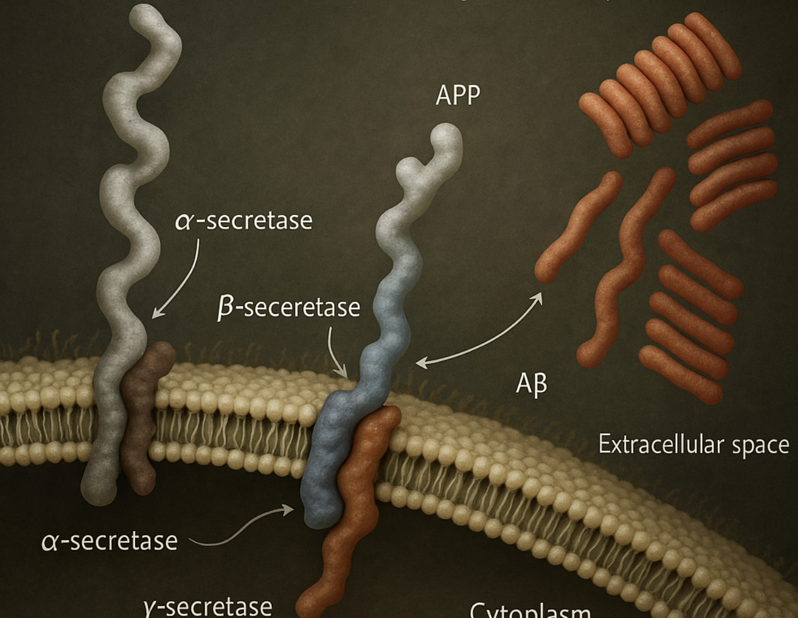

# Copyright & Attribution

## Intellectual Property

Intellectual property (IP) is a set of legal rights that protect products of human creativity and ingenuity in the form of inventions, expressions, ideas, symbols, and designs. These rights give the owner the exclusive right to profit from the IP's use or distriubution, and the owner can license or sell these rights to others. The most common varieties of IP include patents, copyright, tradmearks, and industrial designs, which have varying durations.

## What is Copyright?

Copyright is a legal framework that balances rewarding creators of literary, musical, and artistic works while eventually allowing society to freely use and build upon creative outputs. The core role of copyright is to:
- grant creators exclusive rights to benefit financially from their work
- protect the reputation of authors and ensure the integrity of their work
- after an apporopriate period, revert the created work to the public domain to enable cultural enrichment and ongoing creation

## Copyright and AI

There are two principal ways in which copyright is implicated in AI:
- In terms of AI model training: In order to create AI models, vast swaths of copyrighted material have been ingested by companies like OpenAI and Anthropic. Did the authors give permission? Were they compensated for the use of their works? In most cases that answers to those questions is no, and there are numerous court cases challenging this usage on copyright grounds.
- In terms of the model's output: what is the copyright status of the generated work? Does the human initiator/prompter own the copyright to the work?

### Model Training

### Output Copyright

#### Copyright in Canada

In order to be eligible for copyright protection the Canadian Copyright Act (Department of Justice Canada 2024) requires that a work must be: 
- an “expression of an idea with an exercise of skill and judgment”
- fixed in some medium
- original (not a mere copy of another work), and
- authored by a “natural person”. (Library of Parliament 2025)

## Overview

Lorem ipsum dolor sit amet, consectetur adipiscing elit, sed do eiusmod tempor incididunt ut labore et dolore magna aliqua.
