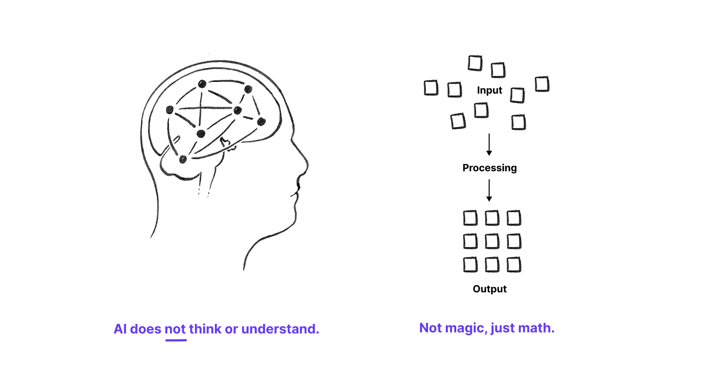

# Understanding AI
At this point, you've likely encountered terms like "generative AI," "large language models," and "diffusion models" thrown. These concepts are often mentioned together, but they refer to different technologies and ideas. This page clarifies and distinguishes these key terms. It introduces the essential concepts you need to understand AI in the context of Scientific Visualization (SciViz), particularly as they relate to image generation and visual production.

## Overview

Artificial Intelligence refers to systems designed to perform tasks such as recognition, prediction, classification, and generation. In the context of visual production, AI systems do not “understand” images in a semantic or experiential sense. **Rather, they detect and reproduce statistical regularities across large datasets.**

Understanding AI in image production requires shifting from a metaphor of machine “thinking” to one of probabilistic modeling. AI models do not possess intention or awareness; they operate through mathematical transformations that encode relationships between pixels, shapes, textures, and semantic descriptors.

For creative practitioners, this distinction is crucial. AI is not an autonomous artist. It is a structured system for pattern synthesis.

## Types of AI
Machine learning
Deep learning
Artificial intelligence
Generative AI
Neural networks
Generative adversarial networks (GANs)

## Generative AI
Generative AI refers to systems that can create new content (whether that's text, images, 3D models, or other media) based on patterns learned from large datasets. Think of it this way: traditional 3D modeling software does exactly what you tell it to do. When you extrude a polygon or apply a texture, the software executes specific mathematical operations you've commanded. Generative AI, on the other hand, has learned from millions of inputs what "realistic human skin texture" tends to look like, and when you ask for it, the system generates something new based on those learned patterns...not by following a rule you wrote, but by recognizing and reproducing patterns it has internalized. This distinction is crucial because it fundamentally changes both the capabilities and the limitations of these tools.

### Large Language Models (LLMs)
X

### Diffusion Models
X

### Diffusion Models
X

#### Author(s)
Shehryar (Shay) Saharan  
Last edited: 25-Feb-2026  
*Report any inaccuracies or suggest updates*

