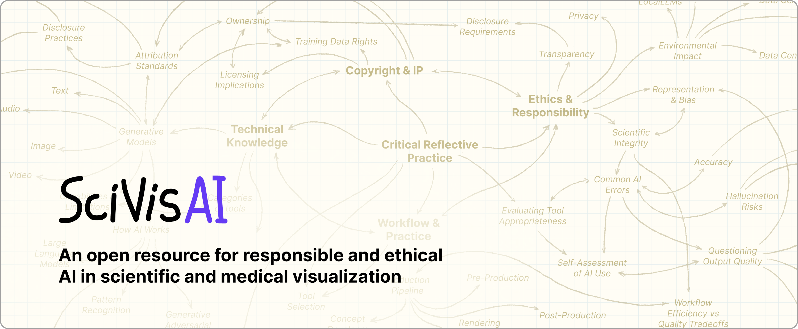

<picture>
	<source media="(max-width: 40rem)" srcset="HomeHeader_Mobile.png">
	
</picture>

Scientific and medical visualization professionals are navigating a rapidly evolving AI landscape. This resource hub provides field-specific guidance, technical experiments, and ethical frameworks to help practitioners, educators, and students integrate AI tools responsibly into their practice.

## Who Is This For

### Professionals
For practicing medical illustrators and science visualization professionals, this resource offers workflow guidance grounded in real production contexts, case studies, and clear guidance on copyright and ethical use.

### Students
If you're entering the field, this resource provides a grounded, critical understanding of how AI intersects with scientific and medical visualization, both its possibilities and its limitations.

### Educators
This resource provides information and materials to support the integration of AI topics into your teaching, including discussions related to ethical frameworks, case studies, and pedagogical resources developed specifically for biomedical communications and scientific illustration programs.

## Why This Matters Now
AI tools are already reshaping scientific and medical visualization workflows today. Practitioners are experimenting with generative tools. Publishers are establishing new disclosure requirements. Institutions are creating policies about AI disclosure and attribution. Many of our day-to-day software now have build in AI features. Whether you're skeptical about AI or enthusiastically experimenting, we need to create space for open dialog, and collaboration -  this resource is one way to do that.

# AI in Science Visualization

AI has been an area of intense interest and concern for the field of medical illustration, and science visualization more generally. Our assessment is that, at least for the present, AI presents very little threat to the medical illustration field. Medical illustration, in contrast to most editorial and other specialty illustration fields, is mostly insulated from AI for the following reasons:

**Accuracy**: our field is known for rigour and accuracy: while current AI image generators can create superficially impressive images, they are woefully bad at representing even the simplest anatomy, not to mention cell or molecular biology.

**Hallucination**: all generative AI apps suffer from the issue of confidently produced hallucinations. Clients want a knowledgeable human to create and vet their communications work.

**Accountability**: most Pharma and biotech clients require that human expertise is accountable for the things they are putting out into the world. Which leads to:

**Liability**: the potential downside risk of litigation based on misleading AI-generated illustrations may exceed the benefit of low-cost AI work.

**Copyright**: Most copyright authorities around the world have decided that AI generated images are not protected by copyright. Most clients will be unwilling to use communications work that is in the public domain, and which can legally be used and modified by their competitors.

**Empathy**: much medical illustration work these days involves communicating to specialized (and sometimes vulnerable) audiences. Humans are good at deploying appropriate design strategies to ensure that their illustrations, animations, or interactive works are appropriate, usable, and effective for their particular target audiences. AI tools have not demonstrated their efficacy in this area.

Having said all this, AI technology is developing rapidly, and no one knows what the future will bring. Some of the limitations of AI are inherent, though, and we think there will be a role for trained human science communicators for the foreseeable future.  We are watching developments in AI closely, and there are limited ways in which we are introducing these tools into our curriculum. We are developing guidelines around where we can use AI tools, driven by our overarching concern for accuracy, usefulness, and ethically trained models.

Additionally, many people see serious issues associated with the use of AI:

- Ethical concerns: many generative AI systems have been developed by training on the intellectual property of artists and writers. These creators have not consented to this use, and have not been compensated by the AI companies (which stand to make many billions). It is worth noting that some AI systems have been trained ethically, using datasets that are newly created or properly licensed.

- Job displacement: there is concern for significant unemployment impacts as AI starts to replace human workers.

- Environmental impacts: many are concerned about the energy required for training and inference, and the demand for land, material, and water resources for AI data centres.

### Contributing
This resource hub grows stronger with community participation. 
We welcome:

Technical experiments and case studies
Tool reviews and workflow documentation
Teaching materials and pedagogical insights
Feedback on existing content

### About This Project
This resource hub is led by [Shehryar (Shay) Saharan](mailto:s.saharan@utoronto.ca) and [Nick Woolridge](mailto:n.woolridge@utoronto.ca) at [Biomedical Communications, University of Toronto](https://bmc.med.utoronto.ca/), with [Gael McGill](mailto:mcgill@crystal.harvard.edu) (Harvard Medical School) and [Roxanne Ziman](mailto:roxanne.ziman@uib.no) (University of Bergen).

### Questions or feedback?
[Contact information]

## Information Hierarchy

- [Foundations](foundations/)
- [Ethics & Responsible Use](ethics-responsible-use/)
- [AI in Visual Production](ai-in-visual-production/)
- [Technology Guides](technology-guides/)
- [Case Studies](case-studies/)
- [Interactive Tool Directory](interactive-tool-directory/)
- [How to Contribute](how-to-contribute/)

