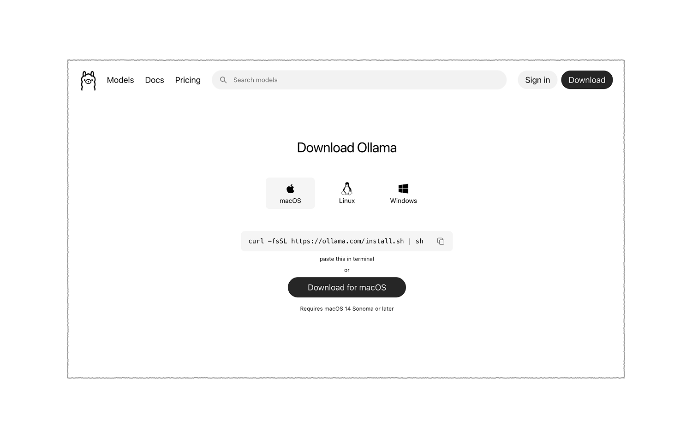
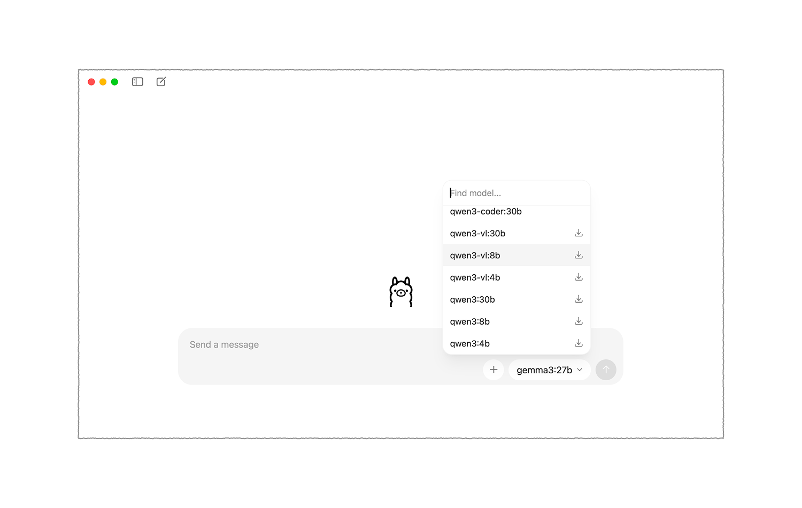

# Local LLMs

## Overview

The core idea of local LLMs is simple: instead of sending your prompts to a company's server somewhere in the cloud, the model runs directly on your machine. Your data never leaves. There are no subscriptions, no rate limits, and no one reading your conversations. The tradeoff is that your computer's hardware determines how fast and how capable your experience will be, but as you'll see, even modest hardware can run surprisingly good models today. **Running models locally can also reduce unnecessary cloud usage, but inference still has an environmental footprint—see [Environmental Impact](../../ethics-responsible-use/environmental-impact/).** This guide covers everything you need to get started using **graphical, point-and-click tools**, no terminal required.

{: .note-title }
> What "Local" Actually Means
>
> **When a model runs locally, your prompts, your conversations, and your documents never leave your machine**. There's no conversation being logged for training data, and no third-party seeing what you're working on.

---

## The Tools Available to You

Several excellent applications exist for running local LLMs through a proper graphical interface. They differ in their target audience, feature sets, and ease of use, but they share the same underlying goal: making local AI accessible.

**Ollama** is an example of a great local LLM ecosystem. You download it like any other application, and it runs in the background managing your models.

**LM Studio** is a polished, self-contained desktop application that handles everything in one place. It has a great interface and provides a single-app experience. If you want zero setup friction and don't care about extensibility, LM Studio is a great option.

**GPT4All** is one of the oldest players in this space and remains a solid choice for pure simplicity. It has a built-in model library, a straightforward chat interface, and works on essentially any modern computer. Performance and model selection lag behind newer tools, but it's hard to beat for approachability.

Other tools include: AnythingLLM, Msty, PocketPal, etc...

For this guide, we'll walk through **Ollama** as an example.

---

## Setting Up Ollama

### Downloading and Installing

Head to **[ollama.com](https://ollama.com)** and click the download button. Ollama is available for macOS, Windows, and Linux, and it installs exactly like any other application → download, open, drag to Applications (on Mac) or run the installer (on Windows), and you're done.

### Downloading and Running Models

Once Ollama is installed and you have a chat interface ready, you need to actually get a model. The models themselves come from **Ollama's own model library** at [ollama.com/library](https://ollama.com/library). You don't need to visit those sites directly; the apps fetch from them behind the scenes.

---

## Choosing the Right Model

### Start With Your Hardware

The single biggest factor in your experience is whether the model fits comfortably in your computer's memory. Two types of memory matter here:

**GPU VRAM** is the memory on your graphics card. If you have a dedicated GPU (NVIDIA or AMD), this is the fast path, models running on the GPU are dramatically faster than those running on the CPU alone.

**System RAM** is your regular computer memory. If a model doesn't fit in your GPU, it can run on your CPU using system RAM, but expect it to be slower, sometimes significantly so.

As a practical guide for sizing:

A **3B model** (3 billion parameters) uses roughly 2 GB of memory and will run on almost anything made in the last few years. Speed is good, quality is decent for everyday tasks.

A **7B or 8B model** needs roughly 5–6 GB and represents the current sweet spot for most users, capable enough to be genuinely useful, fast enough to feel responsive. A GPU with 6–8 GB VRAM handles this comfortably. Without a GPU, it still runs on CPU but with some patience required.

A **13B model** needs around 8–10 GB and starts to require more capable hardware. On a modern Mac with 16GB of unified memory (Apple Silicon), this runs well.

A **70B model** needs 40+ GB and is really only practical on high-end workstations.

**If you're unsure where to start, download a 7B or 8B model and see how it feels.** You can always go up or down from there.

---

### A Simple Decision Process

When you open Ollama's model library or LM Studio's browser for the first time and feel overwhelmed by the choices, walk through these questions:

**First:** How much memory does my computer have, and do I have a dedicated GPU? Use the sizing guide above to set a ceiling on model size.

**Second:** What am I mainly going to use this for? General chat, coding, document analysis? Let your use case point you toward a model family.

**Third:** Try it for fifteen minutes on your actual tasks. If it feels too slow, go smaller. If the answers feel thin or confused, try a larger model or a more specialized one.

#### Author(s)
Shehryar (Shay) Saharan  
Last edited: 25-Feb-2026  
*Please report any inaccuracies or suggest updates*
